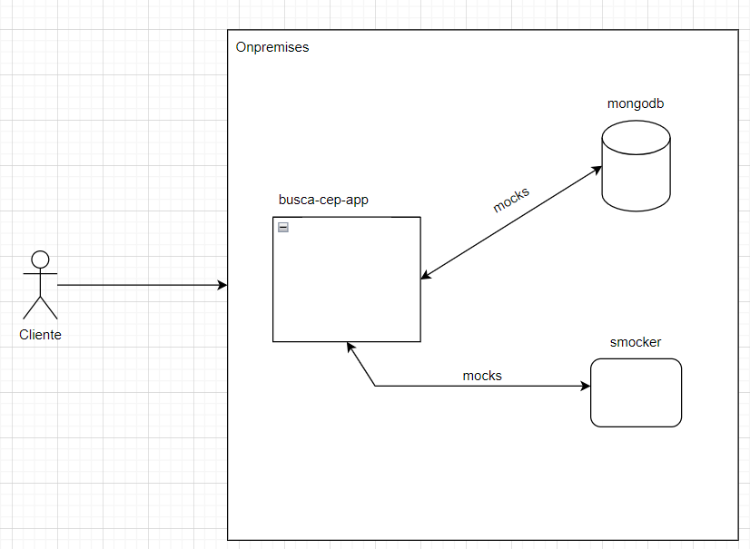

# busca-cep-app

Sistema desenvolvido que consume uma api de cep e realiza logs.

## Arquitetura



## Tecnologias utilizadas

- Java 21
- Spring Boot
- Gradle
- Docker
- Smocker Server
- MongoDB
- Insomnia

## Comando Docker para rodar o Smocker (servidor de mocks)

```sh
docker run \
--restart=always \
-p 8080:8080 \
-p 8081:8081 \
--name smocker \
thiht/smocker
```

Para popular o Smocker com os mocks dos CEP's, faça o CURL abaixo utilizando o arquivo smocker-api.yaml 
ou utilize a collection disponibilizada no projeto "busca-cep-collection.json".

```sh
curl --request POST \
  --url http://localhost:8081/mocks \
  --header 'Content-Type: application/x-yaml' \
  --header 'User-Agent: insomnia/10.1.1' \
  --data 'LSByZXF1ZXN0Og0KICAgIG1ldGhvZDogR0VUDQogICAgcGF0aDogL2Nl
  cC8xMjI4NzY1MA0KICByZXNwb25zZToNCiAgICBzdGF0dXM6IDIwMA0KICAgIGh
  lYWRlcnM6DQogICAgICBDb250ZW50LVR5cGU6IGFwcGxpY2F0aW9uL2pzb24NCiAgICB
  ib2R5OiA+DQogICAgICB7DQogICAgICAgICAgImNlcCI6ICIxMjI4Ny02NTAiLA0KICAg
  ICAgICAgICJsb2dyYWRvdXJvIjogIlJ1YSBEb3V0b3IgSm9zw6kgZGUgTW91cmEgUmVzZ
  W5kZSIsDQogICAgICAgICAgImNvbXBsZW1lbnRvIjogIiIsDQogICAgICAgICAgInVuaW
  RhZGUiOiAiIiwNCiAgICAgICAgICAiYmFpcnJvIjogIlZlcmEgQ3J1eiIsDQogICAgICAg
  ICAgImxvY2FsaWRhZGUiOiAiQ2HDp2FwYXZhIiwNCiAgICAgICAgICAidWYiOiAiU1AiLA
  0KICAgICAgICAgICJlc3RhZG8iOiAiU8OjbyBQYXVsbyIsDQogICAgICAgICAgInJlZ2l
  hbyI6ICJTdWRlc3RlIiwNCiAgICAgICAgICAiaWJnZSI6ICIzNTA4NTA0IiwNCiAgICAg
  ICAgICAiZ2lhIjogIjIzNDMiLA0KICAgICAgICAgICJkZGQiOiAiMTIiLA0KICAgICAgIC
  AgICJzaWFmaSI6ICI2MjcxIg0KICAgICAgfQ=='
```

## Comando Docker para rodar o MongoDB (banco de dados)

Vá a pasta do projeto "busca-cep-app" abra um terminal e execute o comando abaixo:

Para subir os containers:
```sh
docker-compose up
```

Para parar os containers:
```sh
docker-compose down
```

## Contruindo o artefato ".jar"

Vá a pasta do projeto "busca-cep-app" abra um terminal e execute o comando abaixo:

```sh
gradle clean build
```

Obs.: certifique-se de que a variável de ambiente "gradle" esteja configurada.

## Rodando a aplicação manual

Vá a pasta do projeto "/busca-cep-app/build/libs" abra um terminal e execute o comando abaixo:

```sh
java -jar busca-cep-app.jar
```

Obs.: certifique-se de que a variável de ambiente "java" esteja configurada.
